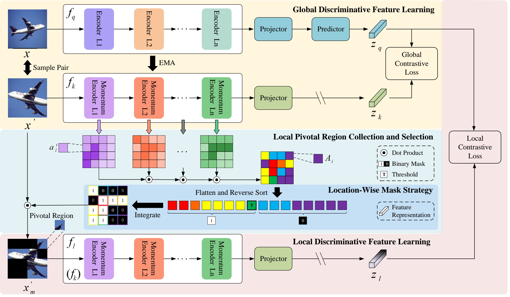

# LoDisc: Learning Complementary Local Discriminative Features for Self-Supervised Fine-Grained Visual Recognition
## Overview of global-local self-supervised fine-grained visual recognition framework.


## Datasets:
* [FGVC-Aircraft](https://paperswithcode.com/dataset/fgvc-aircraft-1)
* [StanfordCars](https://paperswithcode.com/dataset/stanford-cars)
* [CUB-200-2011](https://paperswithcode.com/dataset/cub-200-2011)

## Usage:
### 1. Install the required packages:

```
pip install -r requirements.txt
```

### 2. The running commands for pre-training and retrieval:
```
python main.py \
  -a vit_b_16 -b 32 \
  --optimizer=adamw --lr=1e-3 --weight-decay=0.5 \
  --epochs=100 \
  --stop-grad-conv1 --moco-m-cos --moco-t=.2 \
  --dist-url 'tcp://localhost:10001' \
  --multiprocessing-distributed --world-size 1 --rank 0 \
  [your dataset-folder with train and val folders]
```
### 3. The running commands for linear probing:
```
python main_lincls.py \
  -a vit_b_16 \
  --lr 0.5 \
  --dist-url 'tcp://localhost:10001' \
  --multiprocessing-distributed --world-size 1 --rank 0 \
  --pretrained [your checkpoint path]/[your checkpoint file].pth.tar \
  [your dataset-folder with train and val folders] --class_num [number of categories in your dataset]
```
### 4. Other Matters:
Some content is temporarily restricted but will be made available in the near future.

## Contact:
If there are any issues or questions regarding the codes, please feel free to contact us at shijialu@stu.ouc.edu.cn

## Acknowledgements:
Our implementation is partly based on the open-source implementations from [MoCo v3](https://github.com/facebookresearch/moco-v3) and [LCR](https://github.com/GANPerf/LCR). We gratefully thank the authors for their wonderful works.

## References:
* [Vits.py](https://github.com/pytorch/vision/blob/main/torchvision/models/vision_transformer.py)
* ...


